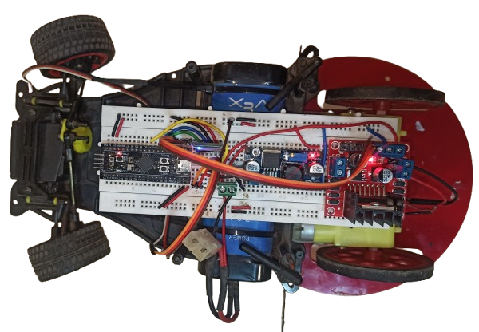

# STM32F411CEU6 Black Pill – Bluetooth RC Car (HC-05 Controlled)

A fully embedded, bare-metal(CMSIS) firmware project built on the **STM32F411CEU6 Black Pill** microcontroller to control a Bluetooth-operated RC Car.
The car receives commands wirelessly from a smartphone using the packet format:

```
<S, steer_angle, throttle, direction>
```

The system drives a **BO DC motor** using an **L298N motor driver**, controls front-wheel steering using an **MG995 high-torque servo**, and operates entirely from a battery-powered system with a buck converter supplying regulated voltage to the microcontroller and logic peripherals.

---

## Features

* **Embedded C firmware (bare-metal (CMSIS), register level)**
* Custom drivers for:
  * TIM1 PWM → Motor (1 kHz)
  * TIM2 PWM → Servo (50 Hz)
  * UART1 → HC-05 Bluetooth (9600 baud)
  * GPIO → Motor direction control
* **Packet-based control**: `<S,steer,throttle,dir>`
* **Dynamic Car Control**:
  * Steering: 0° (Left) → 45° (Straight) → 90° (Right)
  * Throttle: 0–100% duty cycle
  * Direction: Stop / Forward / Reverse

---

## Repository Structure

```
├── Archive
├── Documents
│   ├── bluetooth_HC05_datasheet.pdf
│   ├── motor_driver_l298n_datasheet.pdf
│   ├── servo_MG995_tower_pro_datasheet.pdf
│   └── STM32F411CE/
│       ├── stm32f411ce_datasheet.pdf
│       ├── stm32f411ce_dev_user_manual.pdf
│       └── stm32f411ce_reference_manual.pdf
├── Firmware
│   ├── Src/
│   ├── Startup/
│   ├── Debug/
│   ├── STM32F411CEUX_FLASH.ld
│   └── STM32F411CEUX_RAM.ld
└── Images
└── README.md
```

---

## Hardware Requirements

| Component                    | Description                                              |
| ---------------------------- | -------------------------------------------------------- |
| **STM32F411CEU6 Black Pill** | Main microcontroller                                     |
| **BO DC Motor**              | Rear-wheel drive motor                                   |
| **L298N Motor Driver**       | H-bridge for throttle + direction                        |
| **Tower Pro MG995 Servo**    | Steering (high-torque, 50 Hz PWM)                        |
| **HC-05 Bluetooth Module**   | Wireless control from smartphone                         |
| **Buck Converter**           | Regulates battery voltage to 5 V for MCU + HC-05         |
| **Li-ion / LiPo Battery**    | Main power source                                        |
| **Smartphone**               | Sends control packets over Bluetooth                     |

---

## Pin Mapping – STM32F411CEU6 Black Pill

| Function             | STM32 Pin | Port / AF       | Connected To     | Notes               |
| -------------------- | --------- | --------------- | ---------------- | ------------------- |
| On-board LED         | PC13      | GPIO Output     | On-board LED     | Active low          |
| On-Board User-Button | PA0       | GPIO Input      | Test button      | Pull-up enabled     |
| Motor PWM (Throttle) | PA8       | TIM1_CH1 (AF1)  | L298N ENA        | 1 kHz PWM           |
| Motor Direction 1    | PB12      | GPIO Output     | L298N IN1        | Direction control   |
| Motor Direction 2    | PB13      | GPIO Output     | L298N IN2        | Direction control   |
| Steering Servo PWM   | PA15      | TIM2_CH1 (AF1)  | MG995 Signal     | 50 Hz PWM           |
| UART1 TX             | PA9       | USART1_TX (AF7) | HC-05 RXD        | 9600 baud           |
| UART1 RX             | PA10      | USART1_RX (AF7) | HC-05 TXD        | 9600 baud           |
| System Clock Input   | OSC_IN    | HSE 25 MHz      | External crystal | System clock source |

---

## Communication Protocol

The RC car receives commands in the format:

```
<S,steer,throttle,direction>
```

### Example:

```
<S,45,60,1>
```

### Interpretation:

* **Steer:** 45° (Straight)
* **Throttle:** 60% PWM
* **Direction:** 1 → Forward

| Direction Code | Meaning |
| -------------- | ------- |
| 0              | Stop    |
| 1              | Forward |
| 2              | Reverse |

---

## Firmware Execution Flow

1. MCU powers on → Configures **25 MHz HSE**
2. Initializes:

   * PWM for Motor (TIM1)
   * PWM for Servo (TIM2)
   * UART1 for HC-05
   * GPIO for direction control
3. Sets default state:

   ```
   Steer = 60°  
   Throttle = 0%  
   Direction = Stop  
   ```
4. Continuously listens for Bluetooth packets
5. On receiving a valid packet → `Car_Control()` updates motion

---

## Key Firmware Snippets

### **Car Control**

```c
void Car_Control(uint8_t Steer, uint8_t Throttle, uint8_t Dir)
{
    Servo_TIM2_PWM_SetAngle(Steer);
    Motor_Direction_Control(Dir);
    Motor_TIM1_PWM_SetDutyCycle(Throttle);
}
```

### **UART Packet Parser**

```c
bool UART1_Receive_Packet(uint8_t *steer, uint8_t *throttle, uint8_t *dir)
{
    // Expected format: <S,45,60,1>
    ...
}
```

---

## Demonstration




---

## Acknowledgements

* STM32 Documentation Team
* Tower Pro MG995 Servo Specifications
* HC-05 Open-Source Community
* L298N Motor Driver Technical Resources
* Embedded Register Programming Community
